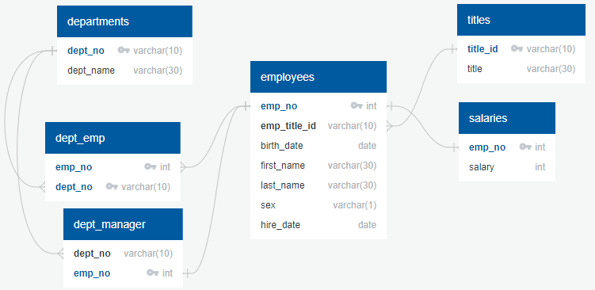

# sql-challenge
Data modeling, data engineering, and data analysis of a historical employee database using PostgreSQL

by Jason Estrada

#### Part 1: Data Modeling

In order to answer questions based on people the company employed during the 1980s and 1990s, data exploration of six CSV files was performed and an entity relationship diagram (ERD) was created to establish relationships across the files.  [QuickDBD](https://app.quickdatabasediagrams.com/#/) was used, and a visual representation can be seen below:

#### Part 2: Data Engineering

Once modeled, a table [schema](./EmployeeSQL/schema.sql) was created in PostgreSQL, and each CSV files was imported to their corresponding table.

#### Part 3: Data Analysis

Eight questions were answered using joins, filters, and aggregate functions.  [Query](./EmployeeSQL/data_analysis_queries.sql)

A Jupyter notebook file was also created to capture notes while working through the project.